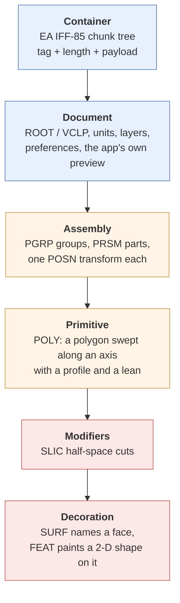
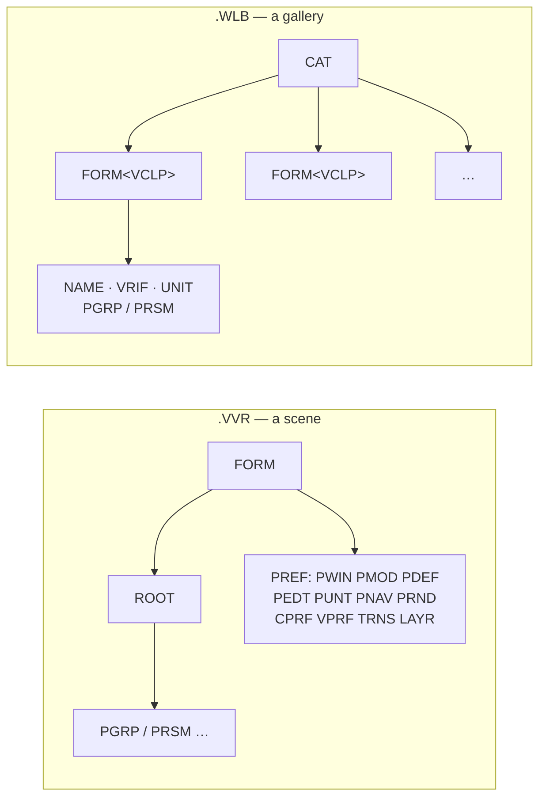

# Design-It! 3-D — how the format works, as best I understand it

A rubber-duck pass over the whole format. The point of writing it out is to find
the corners I've been walking past. Everything here is either **✅ measured**,
**🟡 believed but weakly evidenced**, or **❓ unknown** — and I've tried to be
honest about which, because three times now something I marked ✅ turned out to
be a coincidence that fit the common case.

Companion documents: `FORMAT.md` is the terse spec, `findings/` holds the
per-chunk investigations, and this file is the narrative.

---

## 1. The one-paragraph version

A `.VVR` or `.WLB` file is an **EA IFF-85 chunk tree**. Inside it, every visible
thing in the world is a **`PRSM`** — a 2-D polygon swept along an axis with a
profile function. There is no mesh format anywhere: no vertex buffers, no
triangles, no faces. A chair is a dozen swept polygons. Cuts are half-space
planes (`SLIC`). Surface detail is 2-D vector shapes painted onto named faces
(`SURF`/`FEAT`). Every number is fixed-point `int32 / 65536`. The result is a
procedural CAD format, not a 3-D file format, and almost every bug I've hit came
from assuming otherwise.

---

## 2. The layers, and where the bugs live



Layers 1–2 are **solved and boring**. Layer 3 took two wrong answers to get
right. Layers 4–6 are where every open bug lives, and the pattern is consistent:
*the geometry generators are fine; it's the coordinate frames around them that
keep biting.*

---

## 3. The container ✅

```
┌────────┬──────────────┬────────────────────────────┐
│ tag    │ length       │ payload                    │
│ 4 char │ uint32 BE    │ `length` bytes, no padding │
└────────┴──────────────┴────────────────────────────┘
```

Big-endian, exact lengths, **no even-byte padding** (real IFF pads; this doesn't).
766 of 767 corpus files parse with zero leftover bytes, which is the hard oracle
that makes everything else checkable — a wrong schema fails loudly instead of
drifting.

Three real-world defects to tolerate:

| Defect | Where | Fix |
|---|---|---|
| `FORM<VCLP>` carries a bare 4-byte subtype token (`FEAT`/`PRSM`) with **no length field** | every gallery clip | read 4 bytes when formtype is `VCLP` |
| `FEAT` has a 2-byte header inside `SURF` but not as a top-level 2-D clip | 106 files | context-sensitive header table |
| Shipped `3GALLERY/ID*.WLB` have **stale `CAT` lengths** | 19 files | locate clips by scanning for the `FORM????VCLP` signature |

> **Corner I keep meaning to revisit.** That third one is still unvalidated.
> `Breuer Coffee Table` recovers as 50 parts spread over 61 feet, which is
> obviously wrong, and those six files are excluded from every score I quote.
> They're 6 of 45 galleries — not nothing.

---

## 4. Numbers ✅

Everything is **fp16.16**: a big-endian `int32` divided by 65536. Not floats,
not fixed-precision decimals. One consequence worth remembering: a value that
looks like `3.1416` is *exactly* `205887/65536`, so exact-equality tests against
π work to 4 decimal places and the "is this a round angle?" histograms that
solved the rotation question are reliable.

The exception is **`UNIT`**, which is an IEEE-754 **double**. That was hiding a
bug for the entire project — see §6.

---

## 5. The document layer



`VRIF` is the most useful thing in here: a **50×50 preview bitmap the
application drew itself**, 3,008 of them across the corpus. It's line art, so
flood-filling from the border and inverting gives a silhouette to score against.
It is the closest thing to ground truth we have without running the program.

> **Corner.** The whole `PREF` subtree — 169 of each of `PWIN`, `PMOD`, `PDEF`,
> `PEDT`, `PUNT`, `PNAV`, `PRND`, `CPRF`, `VPRF`, `TRNS`, `LAYR` — is completely
> undecoded. Most of it is window positions and editor preferences and genuinely
> doesn't matter. But `LAYR` contains **named layers** (one literally reads
> `"Stone"`), and `TRNS` looks like it could be transparency. Neither is wired up.

---

## 6. `UNIT` — the bug I found while writing this section ✅

`UNIT` is 8 bytes, and I'd been treating it as opaque. It's an IEEE-754 double
giving **metres per stored unit**:

| value | means | clips |
|---|---|---|
| `0.0254` | 1 inch | 497 |
| `0.00635` | ¼ inch | 30 |
| `0.0025400` | ⅒ inch | 5 |
| `0.0015875` | 1/16 inch | 17 |
| `0.003175` | ⅛ inch | 2 |
| `0.01` | 1 cm | 1 |

So **"1 unit = 1 inch" was only true for most objects**, and everything else was
rendering 4×, 8×, 10× or 16× too large. The proof is that the sizes snap into
place the moment you divide:

| object | raw | ÷ UNIT | verdict |
|---|---|---|---|
| `Bar Stool` | 48 × 48 × 104 | **12 × 12 × 26 in** | a bar stool |
| `Microwave Oven` | 96 × 78 × 62 | **24 × 19.5 × 15.5 in** | a microwave |
| `Fridge, Vert. Black` | 131 × 133 × 262 | **33 × 33 × 65 in** | a fridge |
| `Dishwasher, Brown` | 300 × 318 × 320 | **30 × 32 × 32 in** | a dishwasher |
| `Queen Anne Desk` | 260 × 168 × 280 | **32.5 × 21 × 35 in** | a desk |
| `Pig` | 241 × 96 × 142 | **60 × 24 × 35 in** | a pig |

`UNIT` appears on `ROOT`, `VCLP`, `PGRP` and even `PRSM`, but across 537 nested
occurrences a child **never** disagrees with its ancestor, so one lookup is
enough. Now applied in both implementations.

This is a good illustration of why this document was worth writing: the chunk
was in the census the whole time, marked "8 bytes, unknown", and I never opened
it because nothing looked visibly broken. Nineteen gallery objects were silently
ten times too big.

---

## 7. The assembly layer — `PGRP`, `PRSM`, `POSN`

### 7.1 Child transforms are ABSOLUTE ✅

The single most counter-intuitive fact in the format. A `PGRP`'s `POSN` is **not**
composed onto its children; each part already carries its final placement.

```
       WRONG                            RIGHT
   world = M_group · M_part         world = M_part
```

A nested `PGRP` in `MODELS/A10.VVR` carries a π rotation with negative scales and
its children carry the same flip *again*. Composing applies it twice and explodes
the model. This is almost certainly why earlier loader attempts produced
scattered geometry.

### 7.2 `POSN` layout ✅

```
off  size  field
──────────────────────────────────────────────────────────────
 0    12   translation (x, y, z)            fp16.16
12    12   EULER ANGLES, stored (ry, rx, rz)  ← first two SWAPPED
24    12   ???  non-zero on 2.3 % of parts, small angle-like values
36    12   scale (sx, sy, sz), may be negative
──────────────────────────────────────────────────────────────
      48   full record
      24   SHORT record — stops after the rotation, scale implied (1,1,1)
```

Two traps here, and I fell into both.

**Trap 1 — the short record.** 1003 `POSN`s are 24 bytes because the scale is
identity and the writer just stopped. A 2-D `FEAT` `POSN` is *also* 24 bytes, so
the `len < 48` guard that was meant to exclude `FEAT` silently threw away every
short 3-D record and dumped those parts at the model origin. That was Brutus's
arms fanning out of his chest. **Detached parts: 165 → 49.** Distinguish by
*context* — only `PRSM`/`PGRP` reach the 3-D path — never by length.

**Trap 2 — Euler vs axis-angle.** I published the wrong answer here once, so it
deserves the space.

Fields 3–5 are three Euler angles applied in storage order, `R = Ry · Rx · Rz`.
They are *not* an axis-angle rotation vector, but the corpus fights hard to look
like one:

- a single-axis rotation reads **identically** under both models, and most parts
  use one axis, so most of the corpus renders fine either way;
- a mirrored pair negates the **same two components** under both models, so the
  obvious mirror test — Brutus's two arms — doesn't discriminate either;
- the silhouette oracle scored all six Euler orders *and* axis-angle within
  0.66–0.69, so it couldn't tell them apart.

What settled it was the **distribution of compound values**, not any render:

```
  159 parts carry exactly (180°, 0, 180°)
   and a whole family carries (180°, 0, θ) for
   θ ∈ {−175, −135, −90, −65, −45, 45, 56, 90, 135, 170, …}

  58 % of compound parts have EVERY non-zero component
  within 0.5° of a 45° multiple — the same rate as single-axis parts
```

A rotation vector composed from two round turns does not land on round
components, and certainly doesn't pin one field at exactly 180° across a whole
family. "Flip it over, then turn it" does — and that's what a modelling UI
offers. Under Euler, `(180, 0, 180)` with scale `(−1,−1,−1)` is exactly a mirror
in X, which is what those `ID*` furniture variants are.

| model | detached (of 4083) | mean IoU, compound items |
|---|---|---|
| **Euler yxz, `Ry·Rx·Rz`** | **26** | **0.7882** |
| Euler yxz, `Rx·Ry·Rz` | 26 | 0.7837 |
| axis-angle rotation vector | 40 | — |
| every other field→axis map | 62–167 | — |

> **Corner.** `POSN` fields 6–8 are still unexplained. Non-zero on 2.3 % of
> parts, always small and angle-like. Tested as a second rotation in five
> different compositions; none helped. Given that `POLY`'s "reserved" bytes
> turned out to be a real feature (§8.3), I no longer believe these are padding.

---

## 8. The primitive — `POLY`

### 8.1 Layout

```
off  size  field                                     status
──────────────────────────────────────────────────────────────
 0    1    zero                                        ❓
 1    1    class: 1 custom · 2 rectangle · 3 n-gon      ✅
 2    1    sweep axis (cyclic permutation)              ✅
 3    1    profile function                             ✅
 4    2    nseg — curve subdivision (uint16)            ✅
 6    4    sweep bound za                               ✅
10    4    sweep bound zb                               ✅
14    8    offset of the `za` cap (2 × fp16.16)         ✅ ← was "reserved"
22    8    offset of the `zb` cap (2 × fp16.16)         ✅ ← was 1 comp + "❓"
30    2    vertex count N (uint16)                      ✅ ← was uint32 @ 28
32   8N    vertices (x, y) as fp16.16                   ✅
```

### 8.2 The sweep

```
        polygon (2-D)              profile              result
                                   
         ┌───────┐                 1 straight           ┌───────┐
         │       │       swept     2 pointed            │       │
         │   ·   │   ──────────>   3 diamond            │       │
         │       │    along an     4 rounded            │       │
         └───────┘    axis with    5 sphere             └───────┘
                      a profile
```

Two things are encoded in the *order* of `za` and `zb`, which is why they're
sometimes stored high-first and sometimes low-first:

1. **Taper direction.** A profile's SMALL end sits at `za` — the *first* bound —
   not at whichever end is higher. 124 of 213 pointed prisms have `za < zb`, and
   assuming the apex is always uppermost turns those upside down. That was the
   inverted cones on the Basketball Goal, the Toilet and the BBQ (which also read
   as "missing geometry", because the flipped lid swallowed everything else).
2. **Ring order**, which fixes the face numbering `SURF` indexes into.

The axis byte is a **cyclic permutation**, not a rotation matrix:

```
   3 → (X,Y,Z) = (u, v, w)    upright
   2 → (X,Y,Z) = (v, w, u)    along Y
   1 → (X,Y,Z) = (w, u, v)    along X
        where (u,v,w) = (polygon x, polygon y, sweep)
```

### 8.3 The oblique sweep — the other thing I found this week ✅

Bytes 14–25 are **not padding**. They're three fp16.16 that displace the `za` end
of the sweep, so the extrusion *leans*:

```
    straight sweep              oblique sweep (skew = (0, −7.9, 0))
                                
        ┌───┐                              ┌───┐
        │   │                             /   /
        │   │                            /   /
        │   │                           /   /
        └───┘                          └───┘
```

Non-zero on **341 prisms (5.1 %)**. This surfaced because Greg screenshotted the
`Bar Sink` in the real application and noticed its **faucet leans** while ours
stood bolt upright. That prism carries `(0, −7.87, 0)`. A `6' Work Table` leg
carries `(0, −5, 0)` and a `Conference Table` leg `(0, 5.5, 0)` — splayed legs,
exactly what those previews show.

Measured: detached prisms **51 → 25**, mean IoU over the 24 affected clips
**0.7583 → 0.7702**.

> **Corner.** Which end moves is decided only by the detach oracle (25 vs 40 the
> other way). IoU can't separate the two directions at all — 0.7702 vs 0.7726 on
> 24 clips, pure noise. And `POLY[26:28]`, a small signed int16 sitting right
> next to the skew vector, is non-zero on 72 of those 341 prisms and completely
> unexplained. If the skew is a *lean*, that int16 might be what makes it a
> *bend*.

---

## 9. `SLIC` — cuts ✅

N planes `(a, b, c, d)` as fp16.16, in **object space** (after the axis
permutation), applied in order. Keep the half-space `n·p + d ≥ 0`.

```
     pointed prism            + SLIC plane            = frustum
        /\                        /\
       /  \                      /--\  ← cut            ┌────┐
      /    \                    /    \                  │    │
     /______\                  /______\                 └────┘
```

This is how the program expresses **every tapered box**: 61 % of pointed prisms
carry a `SLIC` versus 6 % of straight ones. `PC, Compaq`'s keyboard is a plain
slab cut corner-to-corner into a wedge; its monitor is a cone truncated 7 in from
the wide end. Brutus's odd wedge-shaped head is the same trick, and is correct.

Two implementation notes that cost real time:

- **Cap from on-plane vertices, not from new edges.** A slab mitred exactly
  corner-to-corner creates *no new vertices* at two of its four cut corners, so
  edge-stitching yields a degenerate sliver. Collect the vertices lying on the
  plane and sort them by angle about their centroid.
- **Compact the vertex array afterwards.** The clipper appends new vertices and
  stops referencing the removed ones. Harmless for drawing, poisonous for
  measuring: a clipped prism's array still holds the geometry that was cut away,
  so its bounding box is the box of the *uncut* prism. That inflated the manifest
  bounds and made cut objects hover above the floor in the explorer.

`ESLC` runs parallel to `SLIC`: `[3 zeros][3 angles][two points on the plane]`.
The angles aren't needed for geometry and are ❓.

---

## 10. Surface decoration — `SURF` / `FEAT`, and the swamp

This is where all the remaining bugs are — though far fewer than they were.
**64 of 19,902 decorations (0.32 %) are still adrift**, and most of those are
too big for any face of their own prism.

### 10.1 Face numbering ✅ (corrected — the old rule was wrong)

```
   face 0            cap at the HIGH end of the sweep
   1 .. bands·n      side faces, band-major; the edge v_j -> v_j+1
                     is face ((j+1) mod n) + 1, i.e. a side face is
                     named after the vertex its edge ARRIVES at
   bands·n + 1       cap at the LOW end
   bands·n + 2 + k   the face created by SLIC cut k
```

**This section previously claimed the sides were the polygon's edges traversed
BACKWARDS, "twice re-verified".** It was wrong, and the way it was wrong is the
most useful lesson in this document.

The verification swept six alternative numberings against the containment
oracle. But that oracle asks only whether a decal escapes its prism's bounding
BOX — and on a rectangular prism the backwards rule and the correct rule differ
*only by swapping opposite faces*. Opposite faces of a box have identical
extents and sit inside the same bounding box, so the oracle scored the right
answer and the wrong answer exactly the same, and reported a tie as a win. Six
alternatives, twice, all measured with an instrument that was blind to the
distinction being tested.

What broke the tie was a sharper oracle (`tools/facefit.py`): ask which
individual FACE the outline fits on, not which box it stays inside.

| side numbering | decorations that do not fit their stored face |
|---|---|
| edges backwards (old) | 126 / 2532 (4.98 %) |
| **arriving vertex (current)** | **22 / 2532 (0.87 %)** |

The symptom in the corpus was subtle by construction: a decal on the far side of
an object still looks like a plausible object, so it survives a flythrough. It
took `Lectern` (pages on the underside), `Microwave, undercabinet` (control
panel on the back) and `Bar Sink` (basin adrift in mid-air, because a 7-vertex
profile makes the two rules diverge properly) to expose it.

**Rule of thumb this earns:** before trusting a sweep, check that the oracle can
actually distinguish the options being swept. A metric that ties on the
discriminating cases will confirm whatever you started with.

### 10.2 The 2-D frame 🟡

Drop the axis the face normal is most aligned with; keep the other two in
ascending axis order, **then flip `u` if needed so that `(u, v, n)` is
RIGHT-HANDED**. Because `u` and `v` come from fixed world axes, the two opposite
faces of a box get the same pair while their outward normals point opposite
ways, so one frame is mirrored — and every decoration on it comes out backwards.
That is why `DEPARTME`'s two escalators carry mirror-image triangles in the file
and only one of them read correctly: the other's triangle crossed the slope
instead of following it. No containment oracle can see this (a mirrored
decoration still fits the same face); it took the render.
**Break an exact tie towards the lowest axis index**, and
take the normal from the area-weighted sum over the face rather than from its
largest triangle. A face at exactly 45 degrees ties two axes, and a single
triangle's cross product carries enough float noise to decide the tie by luck:
the `Jersey Cow`'s two flanks are mirror images, and they were getting
TRANSPOSED frames, one keeping (Y, Z) and the other (X, Y). The spot painted on
the second flank was then laid out along a 7-inch axis using a 59-inch
coordinate, and flew off into space. Rejected alternatives, with their failure
rates:

**The world-axis rule was an approximation.** ✅ The frame is not built from a
pair of world axes at all — it is built from the normal alone:

```
u = normalise(Zup x n)     # the HORIZONTAL direction lying in the face
v = n x u                  # the one going UP it
```

A decoration's x runs *across* a wall and its y runs *up* it, whatever angle the
wall is turned to. Horizontal faces degenerate the cross product and fall back
to the world-axis pair. `(u, v, n)` is right-handed by construction, so the
hand-flip above becomes a no-op rather than a correction.

| frame, over all 19,902 decorations | misfits | adrift (> 15 in) |
|---|---|---|
| world axes, ascending (old) | 464 | 202 |
| **azimuth, `u = Zup × n` (current)** | **324** | **64** |
| azimuth about world X | 6,426 | — |
| azimuth about world Y | 4,017 | — |

The two rules agree on every world-aligned face, which is why the wrong one
survived so many sweeps; they part company exactly where the corpus was failing.
`models/` alone goes from 130 misfits to 6.

### 10.5 What is actually left, measured properly 🟡

`facefit.py` used to scan `data/galleries3d` only — 2,532 of the corpus's 19,902
decorations, **13 %**. Every decoration score quoted before this point was a
score on an eighth of the data. Adding a Models tab to the explorer exposed the
rest immediately. *If you add an oracle, point it at everything.*

Corpus-wide, 469 decorations overhang their face. But a decoration is ALLOWED to
overhang: `CAPECOD`'s windows are a 28×50 frame on a 24×46 wall panel, overhanging
by exactly 2 inches, 110 times over. Read the histogram, not the headline:

| overhang | count | reading |
|---|---|---|
| 0.6 – 2.5 in | 207 | trim, by design |
| 2.5 – 6 in | 28 | mostly trim |
| 6 – 15 in | 27 | borderline |
| **over 15 in** | **207** | **adrift — the real bug** |
| names a face that does not exist | 19 | cut away by SLIC |

So the real population is ~207, and **120 of those are `SPACSTAT` / `SPACESTA`**.

**The space station anomaly — solved.** ✅ Its modules are 8-sided straight
prisms, 720 long along the sweep with 160.4-inch facets, and under the world
rule exactly half the window decals landed and half flew: 60 of 120, twice over.
Greg reported it as *"the pink decals on the space station are flying
everywhere… but not all of them"*, and **but not all of them** was the whole
clue. Four of eight facets fall either side of the 45° line where the dropped
axis changes, so the world rule handed those four the opposite convention from
their neighbours. The azimuth frame is continuous round the prism — the defect
this section predicted must exist — and places all 120.

**The order `Zup x n` is not cosmetic and no oracle can check it.** Both orders
are continuous, and both fit equally well — they differ by a 180-degree turn
about the normal, which moves the frame's origin to the opposite corner of the
face, and a bounds test is symmetric under exactly that. Shipping `n x Zup` put
every decoration in the corpus on the right face upside down and at the far end
of it; `facefit.py` reported **identical** numbers for both. It took the user
reading `VIRTUS` off the shuttle's nose. `Zup x n` reproduces the old world-axis
frame — hand flip included — on every axis-aligned face, so the change is
surgical: it moves 770 of 33,530 decoration meshes, all on tilted facets. The
wrong order moves 16,006.

**Horizontal is decided by INTEGER QUANTISATION, not by an angle.** ✅ The app
builds a side face's normal as the raw perpendicular of its edge and stores it
as three int16 (`seg28:0x5a59`), and that rounding is the rule. `STAWAGON`'s
roof perpendicular is `(-137.3494, -0.2431)` → `(-137, 0)`, exactly horizontal,
so the app uses the fallback frame; our float normal was 0.1 degrees off, so
`Zup x n` resolved to +Y instead of +X and the five 65-inch roof-rack bars came
out turned 90 degrees and overhanging. No tolerance can substitute: the roof is
0.14 degrees off horizontal and wants the fallback, while `SPACSTAT`'s facets are
0.6 degrees off and want the azimuth frame — quantisation separates them and an
angle cannot. A sweep of tolerances confirms it: below 0.01 the wagon stays
broken, above 0.02 the space station breaks again.

One trap in the fix itself: **use the quantised normal only for the in-plane
direction, never as the face's plane.** The face's vertices are coplanar with
respect to the TRUE normal, so measuring the plane offset against the quantised
one makes the origin depend on which vertex you pick — Python sorted the face's
vertex indices, the JS did not, and on `APOLLO` (17,000 units across) that put
the two implementations 69 inches apart on the same decoration. Decoration
positions now agree to within 1.5 in on 13 of 18,047 meshes, all in a file the
two already tessellate differently.

Two methodological traps, both of which produced a confident wrong number:

* **The parity digest cannot see a decal move.** With the z-fight lift off a
  decoration is coplanar with its face, and a planar polygon's signed volume
  depends only on its plane's distance from the origin — not on where in the
  plane it sits. Area is blind too. So `world` and `azim` gave byte-identical
  digests for 113 of 133 files while thousands of decals had moved. Compare
  per-decoration world positions instead; `~/scratch/decalpos.py` does.
* **A same-length source edit can be silently ignored.** `np.cross(up, nrm)` and
  `np.cross(nrm, up)` are the same number of bytes. Python invalidates its
  bytecode cache on source mtime AND SIZE, so on a mount with coarse mtime the
  stale `.pyc` was reused and both halves of an A/B ran the *same* code —
  reporting "0 decorations moved" for a change that moves 16,000. `FACE_FRAME`
  now carries an explicit `'azim_rev'` value so the comparison is a flag, not an
  edit.

Two dead ends on the way, both of which looked like answers:

* **Edge-versus-sweep.** Model the frame as the face's own basis, one axis along
  the polygon edge and one along the sweep, and let an oracle pick the better of
  the two per face: 290 misfits against the world rule's 430. Encouraging, and
  wrong. Nothing predicts the per-face choice better than 99.4 % (the best being
  the sweep's own world direction), and the residue never resolves. The app is
  not choosing between two axes; it is projecting a normal, and the "choice"
  is a side effect.
* **The origin corner.** A sweep of the four corners a face might be measured
  from returned *byte-identical* counts for all four. Flipping an origin maps
  `[0, L]` onto itself, so a both-sides bounds test is structurally incapable of
  seeing it — the same shape of mistake as the six numbering sweeps in §10.1,
  caught this time before it produced a conclusion. **Any oracle built on "does
  it fit" is blind to the origin corner and to mirroring.** Only a render
  settles those.

What remains is not a frame problem. Of the 64 decorations still adrift, all but
a handful fit **no face of their prism at all**: `BEACHCBN` has 24 overhanging by
270 in on a prism whose largest face is nowhere near that size, and `JENSONEX`
two at 960 in. No frame can place a decoration larger than the solid it
decorates. That is a different, still-unexplained mechanism.

### 10.6 Opacity — the byte everyone skips ✅

Every colour record is `(alpha, r, g, b)`, and we were throwing the alpha away.

A **`FEAT`**'s alpha takes exactly three values corpus-wide: 255 opaque
(18,805), 128 translucent (629), and **0 on 468** — and a zero is not decoration
at all. The authors cut openings with it. `BEACHCBN`'s convertible has a
51 x 63 in zero-alpha decal over its cockpit; drawn opaque it is a solid white
slab across the seats, which is exactly how the user found it. The user worked
out the mechanism from the original app before we did.

A **`PRSM`**'s 8-byte COLR is two such records, and **record 1's alpha is 0 in
all 18,038 of them** — record 1 is the inside of the surface, which a solid
never shows; record 2 is what you see. A **`SURF`**'s COLR is the same after its
2-byte prefix. Reading record 1's RGB works only because the two records agree
almost everywhere: of 4,470 two-record SURF colours, exactly **50 differ**, and
`INDYCAR`'s wing end plates are among them — a mirrored pair, one plain white
and one `00 02 | 00 ff 00 00 | ff ff ff ff`, inside red and outside white. We
painted that plate red; the app shows white.

Both implementations now read record 2. Colour sets agree across all 133 files.

**Transparency opens the face now, and so does translucency.** Both alpha 0 and
alpha 128 open the face they sit on — a translucent pane has to show what is
behind the wall, not blend with the wall itself — and the pane is then drawn
back into the opening as its own translucent mesh.

**How the opening is made: a STENCIL, not a retriangulation.** The face keeps
every one of its triangles and gets a small bitmap in its own 2D frame, 255
where the wall is solid and 0 where a decoration has punched through; the
renderer skips those pixels (`alphaTest` on the GPU, a per-pixel test in
`render.py`). `HOLE_MODE` / `options.holeMode` switches between `'mask'`,
`'geom'` and `'off'`.

The first attempt WAS a retriangulation — bridge each hole into the outer loop,
rightmost first, then ear-clip — and it looked right on the two- and three-hole
cases it was tested on. It does not survive the corpus. `REEVES` has a wall
carrying **eighty-two** windows: every later bridge has to thread past the
vertices the earlier ones spliced in, the ring self-intersects, and the clipper
hands back a shredded face. Audited against the area each face should lose, that
wall drops from 254,674 sq in to 34,079 where it should land at 209,079 — **86%
of the wall destroyed** — and eight of the file's nine cut faces are wrong by
more than 2%. On screen it is a wall with huge white wedges gouged out of it,
which is how the user found it. No amount of bridge-ordering care fixes the
general case, and holes are allowed to OVERLAP (a bezel round a screen, a frame
round a picture), which a single outer ring cannot represent at all.

The stencil has none of those failure modes and it is very probably what the
application itself did: a 1993 scanline renderer with no depth buffer makes a
hole by leaving spans unpainted, not by rebuilding the polygon. Corroborating
that, the Virtus VRML exporter does not cut either — it writes the wall whole
and lays a transparent quad on top, which is why its exports show no openings.
Audited the same way, **706 of 727 stencilled faces open exactly the area their
decorations ask for**; 20 of the remaining 21 open LESS, which is correct — a
decoration hanging off the edge of its face is clipped by the face. And where
the data is wrong the failure mode is now benign: `STUDIOHS` has a 324x480 in
decal assigned to a 12x6 in face, and a stencil simply misses, where the
retriangulation destroyed the face.

**The lesson:** the two-and-three-hole unit tests were all green. Nothing in
them was near the case that mattered. When a routine's cost is superlinear in
some input, the test that counts is the largest instance the corpus actually
contains — go and find it before shipping, not after.

**The WRL exports settled the SURF question.** The 2,348 SURF faces at record-2
alpha 0 really are open. The application calls the three states Opaque,
Translucent and Transparent, and its VRML exporter writes them as
`transparency 0.0000 / 0.4980 / 1.0000` — so the export is a per-face oracle for
exactly the byte we were guessing at. Counting it: `KITCHEN` 1 open face and we
read 1, `BEACHCBN` 1 and 1, `DEALEY` 3 open and 3 translucent, ours 3 and 3.
Exact everywhere it can be checked.

That mattered because the change was a side effect, not a decision: making
alpha 128 work made alpha 0 vanish too, and that quietly removed 2,980 of
217,071 triangles across 90 files. 1.37% is small enough to ship unnoticed and
large enough to be a serious regression, so it got a before/after render as well
as the counting. `JENSONIN` is the case that makes it obvious — 635 of those
triangles are in one Victorian house, and with them drawn every window is a flat
grey slab; with them open the panes and mullions appear.

**The lesson, again:** a change enabled as a side effect needs the same evidence
as one you set out to make. The counting told me how much moved; only the render
told me which way was right.

### 10.6b Two texture bugs the parity harness cannot see

**`TXST`'s tile size was decoded in the JS and never in the Python.** For weeks
`d3d.prism_uvs` fell back to 64 in/tile on every texture in the corpus while
`geometry.js` used the real value — so the two renderers disagreed about texture
scale and no oracle noticed, because parity measures geometry and geometry is
unaffected. Anything decoded in one implementation belongs in both the same day.

**A prism can wear more than one texture, and we only ever used the first.**
`PLTX` textures the whole prism and a per-face `SUTX` overrides it; 13 of the
229 textured prisms in the corpus carry more than one id and 9 have a `PLTX`
that per-face records override. Taking one id for the whole prism painted those
faces with the wrong bitmap or left them bare — `JENSONEX` went from 1 textured
mesh to 44 once the id became part of the mesh grouping key rather than a
boolean flag. That is what "some textures are missing" turned out to be.

Not a bug, for the record: `JENSONIN.VVR` and the DESIGNIT `JENSONEX.VVR` carry
**zero** textures — byte-identical across all three source discs — so the
textured Jenson house only exists as `JENSONEX__kesign3d`. The application is
not failing to load them; they are not in the file.

### 10.7 Colour is exact; the LIGHT was what looked wrong ✅

The user reported our colours as slightly off against the application's own
palette swatches. They were not. The stored RGB is a true 24-bit albedo — 619
distinct colours over 194 distinct byte values, far too many for a palette
index — and **every colour we decode appears verbatim in the app's own VRML
export**: `MYHOUSE2` 27/27, `REEVES` 8/8, `KITCHEN` 14/14, zero mismatches.

What was off was the shading. The exporter also writes an `ambientColor` beside
every `diffuseColor`, and over 3,184 materials that ratio is exactly 0.25 — so
the application's whole light model is `albedo * (0.25 + 0.75 * |n . L|)`, one
lamp, no tint. Our viewer had a stylised rig (hemisphere tint, warm key, cool
fill, total intensity 3.5) that made white read blue on top and warm on the
side. Three.js adds two more traps on top: it lights in LINEAR space by default,
so a mid-tone comes out darker than the same multiply on the stored bytes, and
since r155 its intensities are physical, where a lamp of intensity 1 lands as
1/PI of the albedo. Matching the application means all four of:

    THREE.ColorManagement.enabled = false
    renderer.outputColorSpace     = THREE.LinearSRGBColorSpace
    AmbientLight(0xffffff, 0.25 * Math.PI)
    two DirectionalLights facing each other at 0.75 * Math.PI

The two opposed lamps are the `|n . L|`: three.js clamps at zero, and
`max(0, n.L) + max(0, -n.L)` is exactly the absolute value. Probed against a
quad at 0 and 60 degrees for four albedos, the rendered pixel now equals
`round(albedo * (0.25 + 0.75 * cos))` **to the byte on all eight**.

### 10.3 Two coordinate conventions ✅

The `FEAT`'s own `POSN` is 24 bytes: `(x, y, ROTATION, ~0, sx, sy)`.

Field 2 being a **rotation** was itself a find — non-zero on 4.3 % of decals with
unmistakable values (π, π/2, −π/2, π/4, 5.359, −0.2618). We'd been drawing those
unrotated, which leaves a decal the right size in the right place but facing the
wrong way, so it hid behind the louder placement bugs.

And the translation turns out to select the coordinate frame:

```
  (tx, ty) ≠ (0, 0)  →  outline measured from the face's MINIMUM CORNER
  (tx, ty) = (0, 0)  →  outline measured from the face's CENTRE
```

The evidence is a clean cross-tab. Of 2,182 decals *with* a translation, 2,064
fit the corner frame and **none** fit only the other; of 338 *without* one, 309
fit the centre frame and **none** fit only the corner frame. Measured on the
no-translation group alone: centre-origin leaves 19 outside, the prism's bare
local origin 29, the face corner 62.

Applying the split took decals-outside-their-prism from **11.8 % → 3.9 %**.

### 10.4 What's still wrong 🟥

`Bar Sink` is the readable exemplar. Its 13.7 × 15.7 in basin outline is assigned
by `SURF` to **face 6**, which is a 19.7 × **0.5** in sliver on the counter's
rounded end. Face 3 — the counter top, 19.7 × 38.0 — fits it perfectly with room
to spare.

```
   PRSM 0, the counter slab (7-vertex profile, swept 19.7 in)

   face 0  39.7 × 2.0    cap
   face 1  19.7 × 38.8   underside
   face 2  19.7 × 2.0    end
   face 3  19.7 × 38.0   TOP  ← the basin belongs here
   face 4  19.7 × 1.0    chamfer
   face 5  19.7 × 0.9    chamfer
   face 6  19.7 × 0.5    chamfer ← SURF says this one
   face 7  19.7 × 1.1    chamfer
   face 8  39.7 × 2.0    cap
```

So it's the face **index** that's wrong for these, not the frame. But the
stated→fitting delta histogram is scattered — `1:90, 4:61, 2:57, 5:46, 3:37` —
so it isn't an off-by-N either. And 32 of the 159 failures have *no* face on
their prism that fits at all, which means for those the problem is upstream of
face selection entirely.

Same shape of bug: `Jersey Cow`'s one floating spot, `Mac LC`'s screen (which
lands off the monitor's edge under *every* convention I've tried, including the
one that's right for 2,064 other decals), `Tiled Bedroom` at 72 in out.

---

## 11. `Printer w/stand` — a bug I can now describe precisely and still not fix 🟥

Four identical paper sheets. Their `POSN`s differ only in `v[3]` and position;
all four carry scale `(−0.112, −1.0, −0.585)` and the mystery fields 6–8 as
`(0, −0.174, 0)`. The `VRIF` preview draws them as **one continuous curled
ribbon** coming out of the printer's left side. Greg confirms the orientations
look right and only the translation is off.

Our sheets sit along roughly that curve with gaps of **6.1 / 3.7 / 3.1 in** on
9.36 in sheets.

The useful negative result: a grid search over *every possible pair* of sweep
endpoints cannot get the total gap below 10.45 in (the current model gives
12.89). So no reinterpretation of the sheet's own extent closes the chain — the
**positions themselves** must be transformed differently.

Ruled out so far: sibling chaining (much worse), pivot at the geometry centre
(467 detached parts vs 26), pivot at either sweep end, sweep-axis scale anchored
at `za` or `zb`, scale before vs after rotation, `|scale|`, `sz = −1`, fields 6–8
as a second rotation in five compositions, and `CONN` (decoded — it's
`[count][count × 4 × uint16]` snap metadata, and this clip has only one record).

---

## 12. Chunk census — the honest ledger

Everything in the corpus, and whether we do anything with it.

| chunk | count | size | in | status |
|---|---|---|---|---|
| `COLR` | 52,293 | 4 / 8 / 10 | FEAT, PRSM, SURF | ✅ RGB read; **the 10-byte variant has 2 trailing bytes we ignore** ❓ |
| `POSN` | 49,230 | 24 / 48 / 12 | FEAT, PRSM, PGRP | ✅ except fields 6–8 ❓ |
| `POLY` | 47,255 | 36 / 64 / 96 | FEAT, PRSM | ✅ except byte 0 and `[26:28]` ❓ |
| `FEAT` | 26,391 | container | SURF, VCLP | ✅ |
| `LNUM` | 22,839 | 2 | PRSM, PGRP | ❓ **ignored** — layer number, 14 distinct values, pairs with `LAYR` |
| `LOCK` | 21,836 | 2 | PRSM, PGRP | 🟡 ignored — 0 except 5 cases; a UI lock flag |
| `PRSM` | 20,864 | container | PGRP, PRSM, ROOT | ✅ |
| `SURF` | 7,472 | container | PRSM | ✅ |
| `PLGR` | 5,794 | 2 | PRSM | ❓ **ignored** — always 0 in the sample I checked |
| `PGRP` | 1,975 | container | PGRP, PRSM, VCLP | ✅ |
| `SLIC` / `ESLC` | 1,928 ea. | 18 / 34 / 2 | PRSM | ✅ / 🟡 angles unused |
| `VERS` | 1,343 | 4 | VCLP, FORM | 🟡 ignored |
| `UNIT` | 1,128 | 8 | VCLP, PGRP, ROOT | ✅ **as of today** |
| `NAME` | 1,005 | var | VCLP | ✅ |
| `VRIF` | 996 | 4554 | VCLP | ✅ the oracle |
| `TXTB` | 821 | 0 / 17592 / 123144 | VCLP, FORM | ❓ **ignored** — texture blobs |
| `CONN` | 681 | 10–66 | PGRP, PRSM, ROOT | 🟡 decoded, unused |
| `PLTX` | 474 | 32 | PRSM | ❓ **ignored** — payload begins with ASCII `TXID` |
| `LGHT` / `ELGT` | 196 ea. | 68–112 / 8–12 | ROOT, PRSM | ❓ **ignored** — lights |
| `SUTX` `TXID` `TXOD` `TATR` | 110 ea. | 0 / 4 / 4 / 0 | SURF | ❓ **ignored** — per-face texture |
| `SFTX` | 87 | 20 | FEAT | ❓ **ignored** — also begins `TXID` |
| `PREF` subtree | 169 ea. | var | FORM | ❓ ignored; `LAYR` carries **named layers** |
| `VGER` / `VGRS` | 2 | — | FORM | ❓ |

**Reading that table back is uncomfortable.** `PLGR` appears 5,794 times and I
have never looked at it. `LNUM` appears 22,839 times and I've never wired it to
`LAYR`. The texture system (`PLTX`, `SFTX`, `SUTX`/`TXID`/`TXOD`/`TATR`, `TXTB`)
is five chunk types that clearly form one coherent feature — and `PLTX` and
`SFTX` both literally start with the ASCII bytes `TXID`, which means they're the
same record type embedded in two places. That's a thread I've never pulled.

---

## 13. The three oracles, and the lesson

The single most repeated mistake on this project is **trusting silhouette IoU
past its resolution.**

| oracle | what it sees | current baseline |
|---|---|---|
| `score.py` — best-view silhouette IoU vs `VRIF` | gross geometry | — |
| `detach.py` — prisms whose AABB touches no other prism | "floating detached piece" | **25 / 6,487** |
| `decalfit.py` — decal box inside its prism's box | misplaced decoration | **113 / 2,932** |

IoU scored the SLIC clip-vs-no-clip question at 0.7615 against 0.7610 and cost
two long passes on a false tie. It could not separate the six Euler orders from
axis-angle. It cannot tell which end an oblique sweep leans from. It is genuinely
good at gross geometry and genuinely blind below the silhouette.

**The rule I should have written down earlier:** when candidate models score
within a few points of each other, stop scoring and go read the data
distribution instead. Both of the big analytic wins came from histograms rather
than renders — the Euler answer from the distribution of compound angle values,
the decal answer from cross-tabulating "is the translation zero?" against "which
frame contains it?".

And the other rule, which is really about Greg rather than the format: **the most
valuable evidence has consistently been an offhand remark about a shape.** "The
faucet has a slant to it" found an entire `POLY` field that had been written off
as reserved. "You picked the wrong Copy Machine" found the two coordinate
conventions.

---

## 14. Where I'd look next, in order

1. **The texture system.** Five chunk types, one coherent feature, never opened.
   `PLTX` and `SFTX` share a `TXID` record; `SUTX` wraps `TXID`/`TXOD`/`TATR`;
   `TXTB` holds blobs of 17 KB and 123 KB. This is the Key Design 3-D feature set
   and it is completely dark.
2. **`PLGR` (5,794 occurrences) and `LNUM` → `LAYR`.** Cheap to census, and
   `LNUM` at least has a plausible mechanism.
3. **`POLY[26:28]`** — the int16 sitting next to the skew vector, non-zero on 72
   of the 341 skewed prisms. If the skew is a lean, this may be the bend.
4. **`POSN` fields 6–8** — no longer plausibly padding, given §8.3.
5. **The remaining decal face-index problem** — with the caveat that it is *not*
   a global renumbering, and that 32 cases fail on every face, so part of it is
   upstream.
6. **`ID*.WLB` clip recovery** — six galleries currently excluded from all
   scoring.
